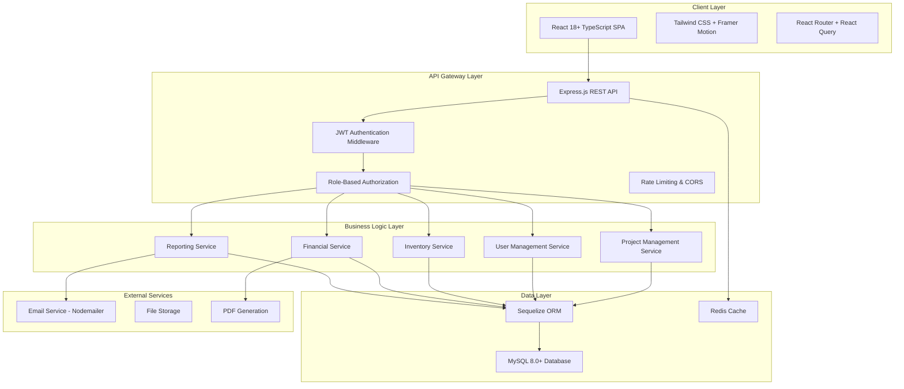
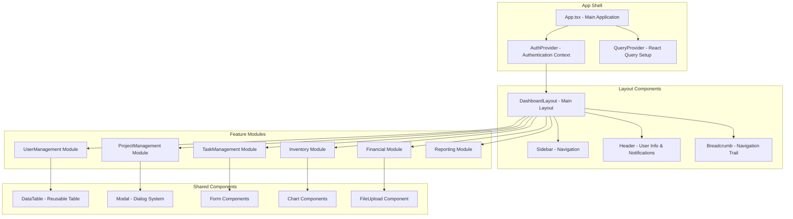

# Design Document

## Overview

The Star Light Constructions Management System (CMS) is designed as a modern, scalable web application using a three-tier architecture. The system leverages React 18+ with TypeScript for the frontend, Node.js with Express.js for the backend API, and MySQL 8.0+ for data persistence. The architecture emphasizes security, performance, and maintainability while supporting role-based access control for multiple user types.

## Architecture

### System Architecture



### Technology Stack

**Frontend:**
- React 18+ with TypeScript for type safety and modern React features
- Tailwind CSS for utility-first styling and responsive design
- Framer Motion for smooth animations and transitions
- React Router for client-side routing
- React Query (TanStack Query) for server state management
- React Hook Form with Joi validation for form handling
- Recharts for data visualization and reporting

**Backend:**
- Node.js with Express.js for RESTful API development
- TypeScript for type safety across the entire stack
- Sequelize ORM for database operations and migrations
- JWT for stateless authentication
- Joi for request validation
- Multer for file upload handling
- Nodemailer for email notifications

**Database:**
- MySQL 8.0+ for relational data storage
- Redis for session management and caching
- Database indexing for performance optimization

## Components and Interfaces

### Frontend Component Architecture



### Backend API Architecture

```mermaid
graph TD
    subgraph "API Routes"
        A[/api/auth - Authentication]
        B[/api/users - User Management]
        C[/api/projects - Project Management]
        D[/api/tasks - Task Management]
        E[/api/inventory - Inventory Management]
        F[/api/quotations - Quotation Management]
        G[/api/purchase-orders - PO Management]
        H[/api/invoices - Invoice Management]
        I[/api/tenders - Tender Management]
        J[/api/feedback - Feedback Management]
        K[/api/reports - Reporting]
    end
    
    subgraph "Controllers"
        L[AuthController]
        M[UserController]
        N[ProjectController]
        O[TaskController]
        P[InventoryController]
        Q[QuotationController]
        R[PurchaseOrderController]
        S[InvoiceController]
        T[TenderController]
        U[FeedbackController]
        V[ReportController]
    end
    
    subgraph "Services"
        W[AuthService]
        X[UserService]
        Y[ProjectService]
        Z[TaskService]
        AA[InventoryService]
        BB[QuotationService]
        CC[PurchaseOrderService]
        DD[InvoiceService]
        EE[TenderService]
        FF[FeedbackService]
        GG[ReportService]
    end
    
    A --> L --> W
    B --> M --> X
    C --> N --> Y
    D --> O --> Z
    E --> P --> AA
    F --> Q --> BB
    G --> R --> CC
    H --> S --> DD
    I --> T --> EE
    J --> U --> FF
    K --> V --> GG
```

## Data Models

### Core Database Schema

```sql
-- Users and Authentication
CREATE TABLE users (
    id INT PRIMARY KEY AUTO_INCREMENT,
    email VARCHAR(255) UNIQUE NOT NULL,
    password_hash VARCHAR(255) NOT NULL,
    role ENUM('Director', 'Project Manager', 'Quantity Surveyor', 'Sales Manager', 
              'Customer Success Manager', 'Employee', 'Customer', 'Supplier') NOT NULL,
    status ENUM('Active', 'Inactive', 'Pending') DEFAULT 'Pending',
    email_verified BOOLEAN DEFAULT FALSE,
    created_at TIMESTAMP DEFAULT CURRENT_TIMESTAMP,
    updated_at TIMESTAMP DEFAULT CURRENT_TIMESTAMP ON UPDATE CURRENT_TIMESTAMP,
    INDEX idx_email (email),
    INDEX idx_role (role),
    INDEX idx_status (status)
);

CREATE TABLE user_profiles (
    user_id INT PRIMARY KEY,
    first_name VARCHAR(100) NOT NULL,
    last_name VARCHAR(100) NOT NULL,
    phone VARCHAR(20),
    address TEXT,
    company_name VARCHAR(255),
    position VARCHAR(100),
    avatar_url VARCHAR(500),
    FOREIGN KEY (user_id) REFERENCES users(id) ON DELETE CASCADE
);

-- Projects and Tasks
CREATE TABLE projects (
    id INT PRIMARY KEY AUTO_INCREMENT,
    name VARCHAR(255) NOT NULL,
    description TEXT,
    client_id INT,
    project_manager_id INT,
    start_date DATE NOT NULL,
    end_date DATE NOT NULL,
    budget DECIMAL(15,2) NOT NULL,
    actual_cost DECIMAL(15,2) DEFAULT 0,
    status ENUM('Planning', 'In Progress', 'On Hold', 'Completed', 'Closed') DEFAULT 'Planning',
    location TEXT,
    project_type VARCHAR(100),
    created_by INT NOT NULL,
    created_at TIMESTAMP DEFAULT CURRENT_TIMESTAMP,
    updated_at TIMESTAMP DEFAULT CURRENT_TIMESTAMP ON UPDATE CURRENT_TIMESTAMP,
    FOREIGN KEY (client_id) REFERENCES users(id),
    FOREIGN KEY (project_manager_id) REFERENCES users(id),
    FOREIGN KEY (created_by) REFERENCES users(id),
    INDEX idx_status (status),
    INDEX idx_client (client_id),
    INDEX idx_manager (project_manager_id),
    INDEX idx_dates (start_date, end_date)
);

CREATE TABLE tasks (
    id INT PRIMARY KEY AUTO_INCREMENT,
    project_id INT NOT NULL,
    assigned_to INT,
    title VARCHAR(255) NOT NULL,
    description TEXT,
    status ENUM('Not Started', 'In Progress', 'Completed', 'On Hold') DEFAULT 'Not Started',
    priority ENUM('Low', 'Medium', 'High', 'Critical') DEFAULT 'Medium',
    start_date DATE,
    due_date DATE,
    completion_percentage INT DEFAULT 0,
    estimated_hours DECIMAL(8,2),
    actual_hours DECIMAL(8,2) DEFAULT 0,
    created_by INT NOT NULL,
    created_at TIMESTAMP DEFAULT CURRENT_TIMESTAMP,
    updated_at TIMESTAMP DEFAULT CURRENT_TIMESTAMP ON UPDATE CURRENT_TIMESTAMP,
    FOREIGN KEY (project_id) REFERENCES projects(id) ON DELETE CASCADE,
    FOREIGN KEY (assigned_to) REFERENCES users(id),
    FOREIGN KEY (created_by) REFERENCES users(id),
    INDEX idx_project (project_id),
    INDEX idx_assigned (assigned_to),
    INDEX idx_status (status),
    INDEX idx_priority (priority),
    INDEX idx_due_date (due_date)
);

-- Inventory and Products
CREATE TABLE categories (
    id INT PRIMARY KEY AUTO_INCREMENT,
    name VARCHAR(255) NOT NULL,
    description TEXT,
    parent_id INT,
    created_at TIMESTAMP DEFAULT CURRENT_TIMESTAMP,
    FOREIGN KEY (parent_id) REFERENCES categories(id),
    INDEX idx_parent (parent_id)
);

CREATE TABLE suppliers (
    id INT PRIMARY KEY AUTO_INCREMENT,
    company_name VARCHAR(255) NOT NULL,
    contact_person VARCHAR(255),
    email VARCHAR(255),
    phone VARCHAR(20),
    address TEXT,
    tax_number VARCHAR(50),
    payment_terms VARCHAR(100),
    rating DECIMAL(3,2) DEFAULT 0,
    status ENUM('Active', 'Inactive') DEFAULT 'Active',
    created_at TIMESTAMP DEFAULT CURRENT_TIMESTAMP,
    updated_at TIMESTAMP DEFAULT CURRENT_TIMESTAMP ON UPDATE CURRENT_TIMESTAMP,
    INDEX idx_status (status),
    INDEX idx_rating (rating)
);

CREATE TABLE products (
    id INT PRIMARY KEY AUTO_INCREMENT,
    category_id INT,
    name VARCHAR(255) NOT NULL,
    description TEXT,
    sku VARCHAR(100) UNIQUE,
    unit_price DECIMAL(10,2) NOT NULL,
    stock_quantity INT DEFAULT 0,
    minimum_stock INT DEFAULT 0,
    unit_of_measure VARCHAR(50),
    supplier_id INT,
    image_urls JSON,
    specifications JSON,
    status ENUM('Active', 'Inactive') DEFAULT 'Active',
    created_at TIMESTAMP DEFAULT CURRENT_TIMESTAMP,
    updated_at TIMESTAMP DEFAULT CURRENT_TIMESTAMP ON UPDATE CURRENT_TIMESTAMP,
    FOREIGN KEY (category_id) REFERENCES categories(id),
    FOREIGN KEY (supplier_id) REFERENCES suppliers(id),
    INDEX idx_category (category_id),
    INDEX idx_supplier (supplier_id),
    INDEX idx_sku (sku),
    INDEX idx_stock (stock_quantity),
    INDEX idx_status (status)
);

-- Business Documents
CREATE TABLE quotations (
    id INT PRIMARY KEY AUTO_INCREMENT,
    quotation_number VARCHAR(50) UNIQUE NOT NULL,
    customer_id INT NOT NULL,
    project_id INT,
    total_amount DECIMAL(15,2) NOT NULL,
    tax_amount DECIMAL(15,2) DEFAULT 0,
    discount_amount DECIMAL(15,2) DEFAULT 0,
    status ENUM('Draft', 'Sent', 'Approved', 'Rejected', 'Expired') DEFAULT 'Draft',
    valid_until DATE,
    notes TEXT,
    created_by INT NOT NULL,
    created_at TIMESTAMP DEFAULT CURRENT_TIMESTAMP,
    updated_at TIMESTAMP DEFAULT CURRENT_TIMESTAMP ON UPDATE CURRENT_TIMESTAMP,
    FOREIGN KEY (customer_id) REFERENCES users(id),
    FOREIGN KEY (project_id) REFERENCES projects(id),
    FOREIGN KEY (created_by) REFERENCES users(id),
    INDEX idx_customer (customer_id),
    INDEX idx_project (project_id),
    INDEX idx_status (status),
    INDEX idx_quotation_number (quotation_number)
);

CREATE TABLE quotation_items (
    id INT PRIMARY KEY AUTO_INCREMENT,
    quotation_id INT NOT NULL,
    product_id INT NOT NULL,
    quantity DECIMAL(10,2) NOT NULL,
    unit_price DECIMAL(10,2) NOT NULL,
    total_price DECIMAL(15,2) NOT NULL,
    description TEXT,
    FOREIGN KEY (quotation_id) REFERENCES quotations(id) ON DELETE CASCADE,
    FOREIGN KEY (product_id) REFERENCES products(id),
    INDEX idx_quotation (quotation_id),
    INDEX idx_product (product_id)
);
```

### TypeScript Interfaces

```typescript
// User Management Types
interface User {
  id: number;
  email: string;
  role: UserRole;
  status: UserStatus;
  emailVerified: boolean;
  profile?: UserProfile;
  createdAt: Date;
  updatedAt: Date;
}

interface UserProfile {
  userId: number;
  firstName: string;
  lastName: string;
  phone?: string;
  address?: string;
  companyName?: string;
  position?: string;
  avatarUrl?: string;
}

type UserRole = 'Director' | 'Project Manager' | 'Quantity Surveyor' | 
                'Sales Manager' | 'Customer Success Manager' | 'Employee' | 
                'Customer' | 'Supplier';

// Project Management Types
interface Project {
  id: number;
  name: string;
  description?: string;
  clientId?: number;
  projectManagerId?: number;
  startDate: Date;
  endDate: Date;
  budget: number;
  actualCost: number;
  status: ProjectStatus;
  location?: string;
  projectType?: string;
  createdBy: number;
  createdAt: Date;
  updatedAt: Date;
  client?: User;
  projectManager?: User;
  tasks?: Task[];
}

type ProjectStatus = 'Planning' | 'In Progress' | 'On Hold' | 'Completed' | 'Closed';

interface Task {
  id: number;
  projectId: number;
  assignedTo?: number;
  title: string;
  description?: string;
  status: TaskStatus;
  priority: TaskPriority;
  startDate?: Date;
  dueDate?: Date;
  completionPercentage: number;
  estimatedHours?: number;
  actualHours: number;
  createdBy: number;
  createdAt: Date;
  updatedAt: Date;
  project?: Project;
  assignee?: User;
}

// Financial Types
interface Quotation {
  id: number;
  quotationNumber: string;
  customerId: number;
  projectId?: number;
  totalAmount: number;
  taxAmount: number;
  discountAmount: number;
  status: QuotationStatus;
  validUntil?: Date;
  notes?: string;
  createdBy: number;
  createdAt: Date;
  updatedAt: Date;
  customer?: User;
  project?: Project;
  items?: QuotationItem[];
}
```

## Error Handling

### Frontend Error Handling Strategy

```typescript
// Global Error Boundary
class ErrorBoundary extends React.Component<Props, State> {
  constructor(props: Props) {
    super(props);
    this.state = { hasError: false, error: null };
  }

  static getDerivedStateFromError(error: Error): State {
    return { hasError: true, error };
  }

  componentDidCatch(error: Error, errorInfo: React.ErrorInfo) {
    console.error('Error caught by boundary:', error, errorInfo);
    // Send to error reporting service
  }

  render() {
    if (this.state.hasError) {
      return <ErrorFallback error={this.state.error} />;
    }
    return this.props.children;
  }
}

// API Error Handling with React Query
const useProjects = () => {
  return useQuery({
    queryKey: ['projects'],
    queryFn: async () => {
      const response = await api.get('/projects');
      return response.data;
    },
    onError: (error: ApiError) => {
      toast.error(error.message || 'Failed to fetch projects');
    },
    retry: (failureCount, error) => {
      if (error.status === 401) return false; // Don't retry auth errors
      return failureCount < 3;
    }
  });
};
```

### Backend Error Handling

```typescript
// Global Error Handler Middleware
export const errorHandler = (
  err: Error,
  req: Request,
  res: Response,
  next: NextFunction
) => {
  logger.error(err.stack);

  if (err instanceof ValidationError) {
    return res.status(400).json({
      error: 'Validation Error',
      message: err.message,
      details: err.details
    });
  }

  if (err instanceof AuthenticationError) {
    return res.status(401).json({
      error: 'Authentication Error',
      message: 'Invalid credentials'
    });
  }

  if (err instanceof AuthorizationError) {
    return res.status(403).json({
      error: 'Authorization Error',
      message: 'Insufficient permissions'
    });
  }

  // Database errors
  if (err.name === 'SequelizeValidationError') {
    return res.status(400).json({
      error: 'Database Validation Error',
      message: err.message
    });
  }

  // Default server error
  res.status(500).json({
    error: 'Internal Server Error',
    message: process.env.NODE_ENV === 'production' 
      ? 'Something went wrong' 
      : err.message
  });
};

// Custom Error Classes
export class ValidationError extends Error {
  constructor(message: string, public details?: any) {
    super(message);
    this.name = 'ValidationError';
  }
}

export class AuthenticationError extends Error {
  constructor(message: string = 'Authentication failed') {
    super(message);
    this.name = 'AuthenticationError';
  }
}
```

## Testing Strategy

### Frontend Testing Approach

```typescript
// Component Testing with React Testing Library
describe('ProjectList Component', () => {
  it('should display projects when data is loaded', async () => {
    const mockProjects = [
      { id: 1, name: 'Test Project', status: 'In Progress' }
    ];

    render(
      <QueryClient>
        <ProjectList />
      </QueryClient>
    );

    // Mock API response
    server.use(
      rest.get('/api/projects', (req, res, ctx) => {
        return res(ctx.json(mockProjects));
      })
    );

    await waitFor(() => {
      expect(screen.getByText('Test Project')).toBeInTheDocument();
    });
  });

  it('should handle loading and error states', async () => {
    render(<ProjectList />);
    
    expect(screen.getByText('Loading...')).toBeInTheDocument();

    // Test error state
    server.use(
      rest.get('/api/projects', (req, res, ctx) => {
        return res(ctx.status(500));
      })
    );

    await waitFor(() => {
      expect(screen.getByText(/error/i)).toBeInTheDocument();
    });
  });
});

// Integration Testing
describe('Project Management Flow', () => {
  it('should create, update, and delete projects', async () => {
    const user = userEvent.setup();
    
    render(<App />);
    
    // Navigate to projects
    await user.click(screen.getByText('Projects'));
    
    // Create new project
    await user.click(screen.getByText('New Project'));
    await user.type(screen.getByLabelText('Project Name'), 'Test Project');
    await user.click(screen.getByText('Save'));
    
    // Verify project appears in list
    await waitFor(() => {
      expect(screen.getByText('Test Project')).toBeInTheDocument();
    });
  });
});
```

### Backend Testing Strategy

```typescript
// Unit Testing for Services
describe('ProjectService', () => {
  let projectService: ProjectService;
  let mockRepository: jest.Mocked<ProjectRepository>;

  beforeEach(() => {
    mockRepository = createMockRepository();
    projectService = new ProjectService(mockRepository);
  });

  describe('createProject', () => {
    it('should create project with valid data', async () => {
      const projectData = {
        name: 'Test Project',
        startDate: new Date(),
        endDate: new Date(),
        budget: 10000
      };

      mockRepository.create.mockResolvedValue({ id: 1, ...projectData });

      const result = await projectService.createProject(projectData);

      expect(result.id).toBe(1);
      expect(mockRepository.create).toHaveBeenCalledWith(projectData);
    });

    it('should throw validation error for invalid data', async () => {
      const invalidData = { name: '' }; // Missing required fields

      await expect(projectService.createProject(invalidData))
        .rejects.toThrow(ValidationError);
    });
  });
});

// API Integration Testing
describe('Projects API', () => {
  let app: Express;
  let testDb: Database;

  beforeAll(async () => {
    testDb = await setupTestDatabase();
    app = createApp(testDb);
  });

  afterAll(async () => {
    await testDb.close();
  });

  describe('POST /api/projects', () => {
    it('should create project with valid data', async () => {
      const projectData = {
        name: 'Test Project',
        startDate: '2024-01-01',
        endDate: '2024-12-31',
        budget: 10000
      };

      const response = await request(app)
        .post('/api/projects')
        .set('Authorization', `Bearer ${validToken}`)
        .send(projectData)
        .expect(201);

      expect(response.body.name).toBe(projectData.name);
      expect(response.body.id).toBeDefined();
    });

    it('should return 401 for unauthorized requests', async () => {
      await request(app)
        .post('/api/projects')
        .send({})
        .expect(401);
    });
  });
});
```

This design document provides a comprehensive technical foundation for the Star Light Constructions Management System, covering architecture, data models, error handling, and testing strategies. The design emphasizes scalability, security, and maintainability while supporting all the requirements specified in the requirements document.